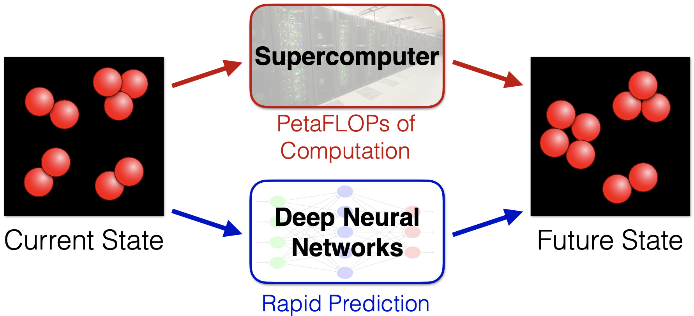

# Deep Learning for Future Prediction in Brownian Dynamics Simulations
Last Updated 07/17/2019

Author: Brian K. Ryu

## Abstract
Computational cost of large and lengthy Brownian Dynamics simulations is a principle challenged faced by scientific researchers. In this work, I utilize deep residual networks to alleviate the computational cost of dynamic simulations by circumventing the computation of every time step and predicting future states of a simulation system. I present qualitative and quantitative evaluations of predictions, which are able to replicate the accuracy of simulations with a system size of 8,788 particles. This novel method for reducing the cost of simulations sets a foundation for a new avenue of deep learning application in the research of physical sciences.

## tl;dr
Explicitly conducting Brownian dynamics simulations is computationally expensive. Here I predict via deep learning future states of a material that evolves stochastically over time to alleviate the computational cost of dynamic simulations.



## Requirements
To run the entire code here including dataset processing, you will need Python3 and the following libraries for Python: Numpy, Scipy, and Tensorflow. 

## Steps to run
1. Obtain simulation snapshots that can be used for training

2. Preprocessing can be run as follows:
```
python ./preprocess.py [Data directory] [Number of particles]
```

3. Training and testing can be run as follows:
```
python ./train.py [Training set directory] [Model File Name to Save] {Dev set directory}
```
```
python ./test.py [Test set directory] [Model .h5 file path]
```

*This project was comlpeted for CS230 Spring 2019 Final Project at Stanford University*

